# Enterprise Active Directory & Wazuh SIEM Detection Lab

A hands-on home lab that deploys a **Windows Server 2022 Active Directory Domain Services (AD DS)** domain controller, hardens it with **Group Policy (GPO)**, and forwards its Windows Security logs to a **Wazuh SIEM** to detect failed logons and account lockouts.

The lab combines two views of the same event: how an **IT support / sysadmin** restores a locked-out user, and how a **SOC analyst** sees and triages the same activity in a SIEM.

> Companion project: [Wazuh SOC Home Lab — RDP brute-force detection](https://github.com/ahmed-atiah/wazuh-soc-home-lab) (remote attack from Kali against a Windows 10 endpoint).

---

## Architecture

```text
+--------------------------------------------------------------------+
|                         VMware Workstation                         |
|                                                                    |
|  +-----------------------------+        +------------------------+ |
|  |   DC-01 (Windows Server     |        |   Wazuh Server         | |
|  |   2022 Datacenter)          |        |   (Ubuntu Linux)       | |
|  |                             |        |                        | |
|  |   Domain: ahmedlab.local    | Agent  |   Wazuh Manager        | |
|  |   AD DS + DNS, static IP    | -----> |   Indexer + Dashboard  | |
|  |   GPO + Advanced Audit      | 1514   |   Web UI (HTTPS)       | |
|  |   Wazuh Agent: DC01-AhmedLab|        |                        | |
|  +-----------------------------+        +------------------------+ |
+--------------------------------------------------------------------+
```

Failed-logon attempts in this lab were generated **locally on the domain controller** (see Phase 6). No separate attacker machine was used.

---

## Skills Demonstrated

- **Identity & Access Management:** created an AD forest (`ahmedlab.local`), an Organizational Unit hierarchy, a user account, and a role-based security group.
- **Group Policy:** configured an account lockout policy in the Default Domain Policy to slow password-guessing attacks.
- **Audit logging:** found that failed logons were not being recorded and fixed it with `auditpol` Advanced Audit Policy subcategories.
- **SIEM onboarding:** installed and enrolled a Wazuh agent on a Windows Server to send the Windows Security event channel to a Wazuh Manager.
- **Alert analysis:** generated failed logons and a lockout, then matched Windows Event IDs to Wazuh rules and alert levels.
- **IT support workflow:** diagnosed a lockout in Event Viewer and unlocked the account in Active Directory Users and Computers.

---

## Technologies & Tools

| Category | Tools |
| :--- | :--- |
| Server OS | Windows Server 2022 Datacenter (Desktop Experience) |
| SIEM | Wazuh 4.x (Manager, Indexer, Dashboard) on Ubuntu Linux |
| Virtualization | VMware Workstation |
| Directory services | Active Directory Domain Services, DNS Server |
| Admin tools | `dsa.msc`, `gpmc.msc`, `eventvwr.msc`, PowerShell, `auditpol.exe`, `runas` |

---

## Implementation

### Phase 1 — Domain Controller deployment
1. Set a static IPv4 address on Windows Server 2022 and pointed primary DNS to loopback (`127.0.0.1`).
2. Renamed the server to `DC-01` before promotion.
3. Installed the **AD DS** and **DNS Server** roles through Server Manager.
4. Promoted the server to a domain controller for a new forest: `ahmedlab.local`.

### Phase 2 — Organizational structure and users
1. Built the OU layout:
   - `Company-Corp`
     - `Departments` → `IT`, `Finance`, `HR`
     - `Security-Groups`
2. Created the security group `SG-Finance-Staff`.
3. Created the test user `Sara Ali` (`sali@ahmedlab.local`) in the Finance OU and added her to `SG-Finance-Staff`.

### Phase 3 — Account lockout policy (GPO)
Configured in the **Default Domain Policy**:

| Setting | Value |
| :--- | :--- |
| Account lockout threshold | 5 invalid logon attempts |
| Account lockout duration | 30 minutes |
| Reset account lockout counter after | 30 minutes |

Applied with:

```cmd
gpupdate /force
```

### Phase 4 — Fixing the logging gap
Initially, failed logon attempts did not appear in the Security log in the form needed for detection. I enabled the relevant Advanced Audit Policy subcategories explicitly:

```cmd
auditpol /set /subcategory:"Logon" /success:enable /failure:enable
auditpol /set /subcategory:"Account Lockout" /success:enable /failure:enable
auditpol /set /subcategory:"Credential Validation" /success:enable /failure:enable
auditpol /set /subcategory:"User Account Management" /success:enable /failure:enable
```

I verified the result with `auditpol /get`. The `Logon` subcategory showed **No Auditing** before the change and **Success and Failure** afterwards.

### Phase 5 — Wazuh agent on the Domain Controller
1. Installed the Windows Wazuh agent on `DC-01`, pointed at the Wazuh Manager IP.
2. Named the agent `DC01-AhmedLab` and confirmed it reported as **Active** in the dashboard (agent traffic uses TCP 1514).
3. Confirmed baseline data (including Security Configuration Assessment results) was arriving.

### Phase 6 — Generating and detecting failed logons
1. Entered a wrong password repeatedly for `sali`, using both `runas` from the command line and the interactive Windows logon screen.
2. After the fifth failed attempt the account was locked out, as configured in the GPO.
3. Watched the events arrive in the Wazuh Dashboard (Threat Hunting / Security Events).
4. Opened the alert details to confirm the fields: Event 4625 shows `targetUserName: sali` and `workstationName: DC-01`, which matches a local attempt made on the domain controller itself.

---

## Detection Results

| Source | ID | Description | Wazuh level | Meaning |
| :--- | :--- | :--- | :---: | :--- |
| Windows Security | Event ID 4625 | An account failed to log on | — | Repeated failures can indicate password guessing. |
| Windows Security | Event ID 4740 | A user account was locked out | — | The lockout threshold was reached. |
| Windows Security | Event ID 4719 | System audit policy was changed | — | Audit configuration changed (relevant for spotting tampering). |
| Wazuh rule | 60122 | Logon Failure – Unknown user or bad password | 5 | Triggered by each wrong password for `sali`. |
| Wazuh rule | 60115 | User account locked out (multiple login errors) | 9 | Higher-priority alert after consecutive failures. |
| Wazuh rule | 60112 | Windows audit policy changed | 8 | Reflects the `auditpol` changes. |

---

## Response Runbooks

These are the steps I would follow for the same event from each side. They describe the procedure; this lab does not include a ticketing system.

### IT support: restore access
1. Confirm the user's identity before any account change.
2. Open `dsa.msc` and find the user under `Company-Corp > Departments > Finance`.
3. On the **Account** tab, select **Unlock account**, then **Apply**.
4. Ask the user to sign in, and check Event Viewer (Event 4740) to see which machine caused the lockout, in case a stale saved password is repeating it.

### SOC analyst: triage the alert
1. Open the **Rule 60115** alert and note the target account, the reporting agent (`DC01-AhmedLab`), and the timestamp.
2. Pivot to the preceding **Rule 60122** events to see how many attempts occurred and how quickly.
3. Check the logon type and source fields to decide whether the attempts came from the machine itself or a remote host.
4. Decide whether this is user error or a possible attack, and record the finding.

---

## Screenshots

| | |
| :--- | :--- |
| 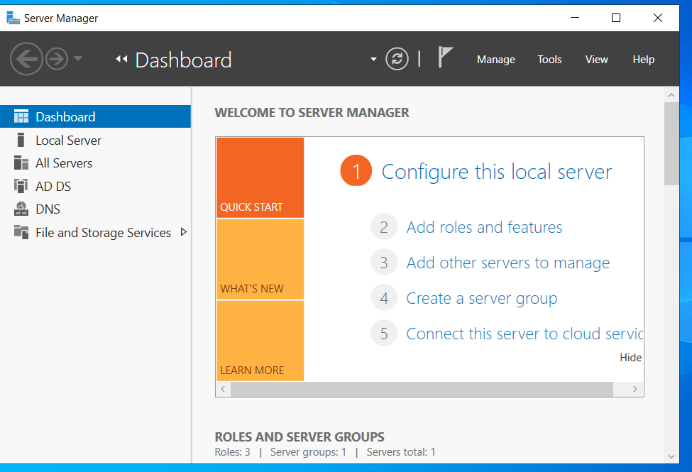 | 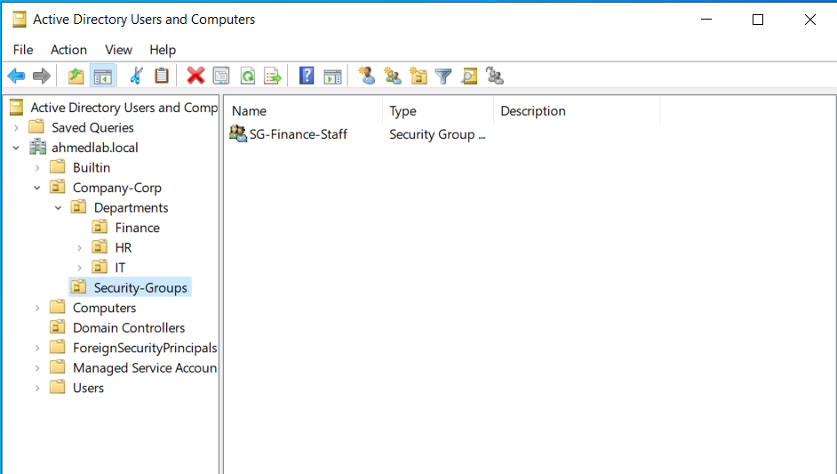 |
| Server Manager showing the AD DS and DNS roles | `SG-Finance-Staff` in the `Security-Groups` OU |
| 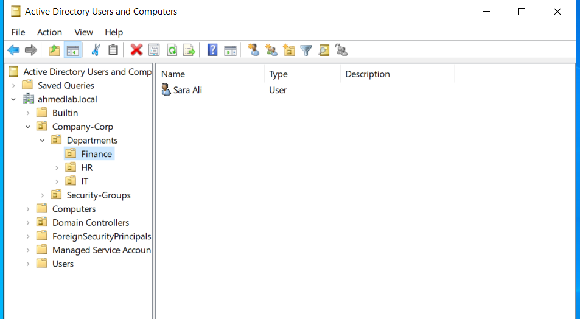 | 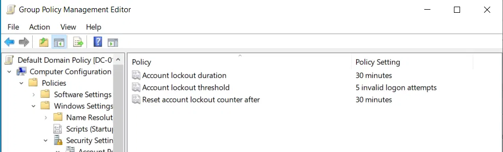 |
| Organizational Units, user, and security group | Account lockout settings in the Default Domain Policy |
| 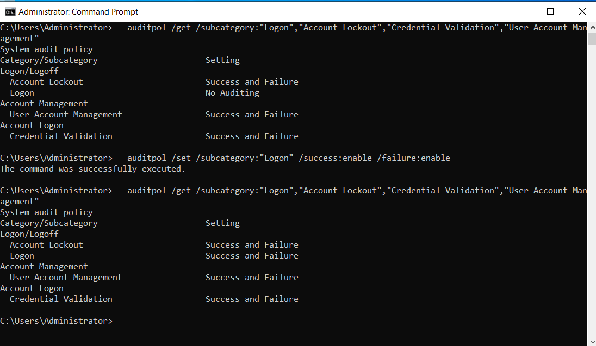 | 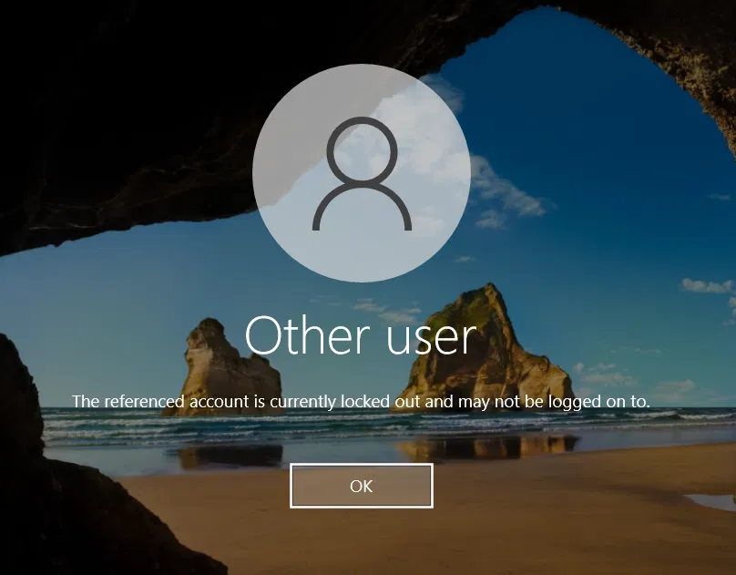 |
| `auditpol /get` before and after enabling `Logon` auditing | Windows message showing the account is locked out |
| 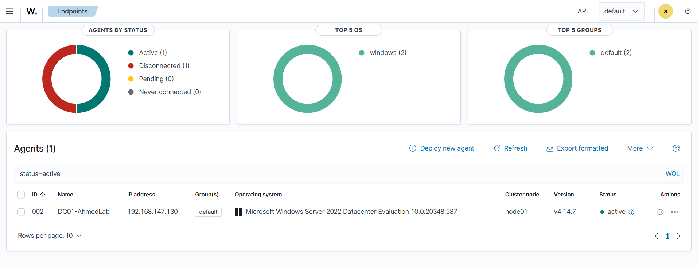 | 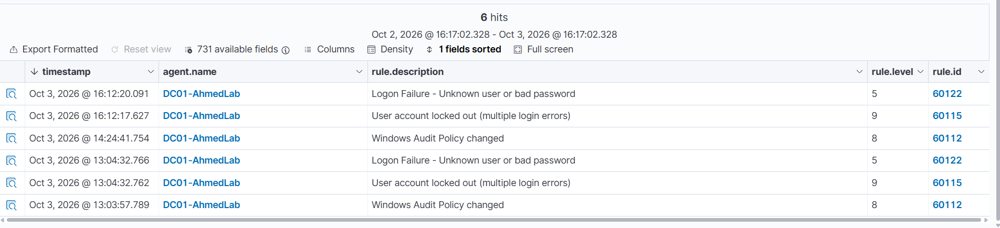 |
| `DC01-AhmedLab` shown as Active | Alerts for rules 60122, 60115, and 60112 |
| 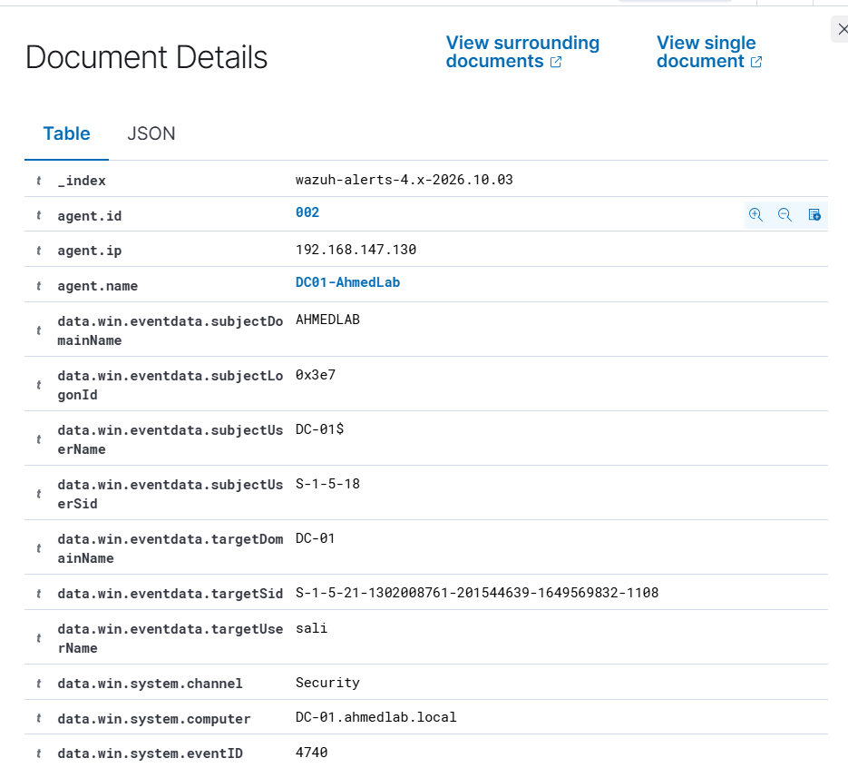 | |
| Wazuh document details for Event ID 4740 (target user `sali`) | |
| 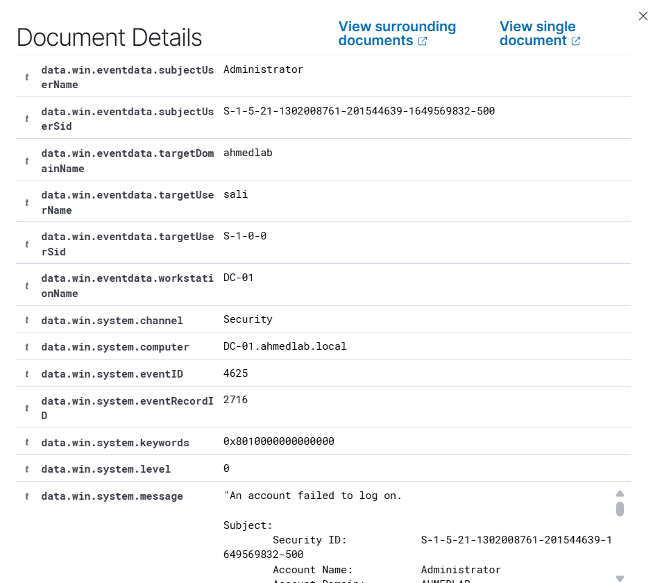 | 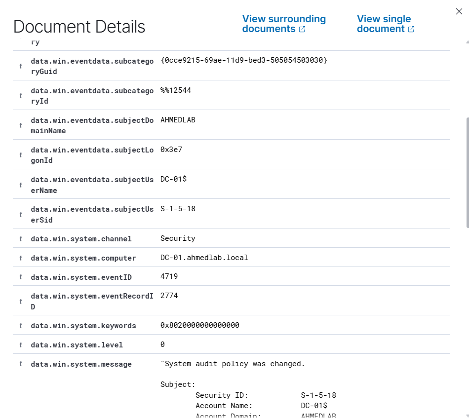 |
| Event ID 4625: target `sali`, workstation `DC-01` (local attempt) | Event ID 4719: audit policy changed (matches Wazuh rule 60112) |

---

## Limitations & Next Steps

- Single domain controller and a single test user; no domain-joined client machine.
- Failed logons were generated locally on the DC, so the lab does not show a remote source IP. The [RDP lab](https://github.com/ahmed-atiah/wazuh-soc-home-lab) covers remote attribution.
- No Sysmon and no custom Wazuh rules yet.
- Planned: join a Windows 10 client to the domain, attempt logons from a Kali VM against the DC, add Sysmon, and write a custom rule for a successful logon that follows a burst of failures.

---

## Author

**Ahmed Atiah** — Computer Engineering graduate
[LinkedIn](https://linkedin.com/in/ahmed-atiah) · [GitHub](https://github.com/ahmed-atiah)
